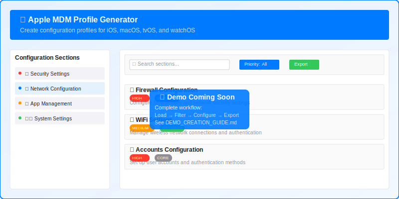

# Apple MDM Profile Generator

Create Apple Mobile Device Management (MDM) configuration profiles with an intuitive web interface. Automatically loads Apple's official MDM specifications and provides smart filtering, categorization, and export functionality.

View site: https://justgoodvibes.github.io/AppleMDMProfileGenerator/

## Demo


*Interactive demo showing: Load specs → Filter sections → Configure parameters → Export profile*

> 📹 **Creating the demo GIF?** See [Demo Creation Guide](docs/DEMO_CREATION_GUIDE.md) for detailed instructions.

## Features

✅ **Auto-loads Apple's official MDM specifications**  
✅ **150+ configuration sections** with smart categorization  
✅ **Priority-based filtering** (High/Medium/Low importance)   
✅ **Real-time search** across all sections and parameters  
✅ **Export** ready-to-use .mobileconfig files (Can be imported into Fleet)  
✅ **Accessibility compliant** with keyboard navigation  (Improvements welcome)  

## Quick Start

This is a pure HTML + JS implementation so any server that can serve a static website will work. 

Below is how to set up testing for development.
1. **Clone and setup**:
   ```bash
   git clone https://github.com/JustGoodVibes/AppleMDMProfileGenerator.git
   cd AppleMDMProfileGenerator
   npm install
   ```

2. **Run the application**:
   ```bash
   # Option 1: Open directly in browser
   open index.html

   # Option 2: Use local server (recommended)
   python3 -m http.server 8080
   # Then visit http://localhost:8080
   ```

3. **Start configuring**:
   - Application auto-loads Apple's MDM specs
   - Browse sections in the sidebar
   - Use filters to find specific configurations
   - Configure parameters and export your profile

## How It Works

1. 🔄 **Auto-loads** Apple's latest MDM specifications
2. 🏷️ **Categorizes** 150+ sections by priority and type
3. 🔍 **Filter & search** to find the configurations you need
4. ⚙️ **Configure** parameters with user-friendly controls
5. 📁 **Export** ready-to-deploy .mobileconfig files

📖 **Need help?** Check the [Quick Reference Guide](docs/QUICK_REFERENCE.md) for detailed usage instructions.

## Supported Configurations

<details>
<summary><strong>📱 Platform Support</strong></summary>

- **iOS** - iPhone and iPad device management
- **macOS** - Mac computer configuration
- **tvOS** - Apple TV settings
- **watchOS** - Apple Watch management

</details>

<details>
<summary><strong>🔧 Configuration Categories</strong></summary>

- **Core System** - Accounts, Restrictions, Top Level settings
- **Security & Privacy** - Firewall, VPN, Certificate Trust
- **Network** - WiFi, DNS, Proxy configurations
- **App Management** - App Store, Managed App Configuration
- **Device Settings** - AirPrint, Bluetooth, Camera controls
- **Authentication** - Single Sign-On, Active Directory
- **UI Customization** - Dock, Finder, Desktop appearance

</details>

<details>
<summary><strong>⚙️ Technical Architecture</strong></summary>

**Modular Design:**
- **Services** - Data fetching, caching, progress tracking, export
- **Managers** - UI state, filtering, section management
- **Components** - Reusable section and parameter components
- **Utilities** - Helper functions, constants, validation

**Data Processing:**
- Direct integration with Apple's official MDM specification API
- Intelligent parsing with robust fallback mechanisms
- Automatic detection and addition of missing MDM sections
- Hierarchical processing for parent-child section relationships

**Testing:**
- Comprehensive unit test suite for all functionality
- Badge system and filter testing
- End-to-end integration tests

</details>

---

## Browser Support
Chrome 90+ • Firefox 88+ • Safari 14+ • Edge 90+

## Contributing
Contributions welcome! Please submit issues, feature requests, or pull requests.

## License & Disclaimer
Not affiliated with Apple Inc. Uses Apple's public MDM specification for educational purposes.

⚠️ **Always test profiles in development before production deployment.**
